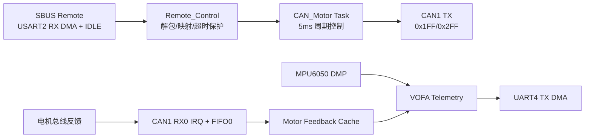

# Predecessor_Task

STM32F405RG + FreeRTOS 项目，核心功能是：

- 通过 USART2 接收 SBUS 遥控数据（DMA + IDLE）
- 将遥控通道映射为电机控制量
- 通过 CAN1 下发电机指令并接收反馈
- 通过 UART4 DMA 输出 IMU 与电机反馈到上位机（VOFA）

## 本次逻辑检查结论

本次针对主控制链路做了静态审查，并修复了 4 个隐藏风险点。当前代码中未发现新的阻断级逻辑错误，但仍建议进行一次硬件联调回归（见“验证清单”）。

已修复项：

1. CAN 接收过滤器未配置
   - 位置：`User/Drivers/Motor/Src/Motor.c`
   - 风险：CAN 接收回调可能不触发，导致反馈始终为空。
   - 修复：在 `Motor_Init()` 中新增 `HAL_CAN_ConfigFilter()`，将过滤器路由到 FIFO0。

2. CAN1 RX0 中断未接入 HAL 处理
   - 位置：`Core/Src/stm32f4xx_it.c`, `Core/Inc/stm32f4xx_it.h`
   - 风险：即使有 CAN 帧到达，也不会进入 HAL CAN IRQ 处理链。
   - 修复：新增 `CAN1_RX0_IRQHandler()` 并调用 `HAL_CAN_IRQHandler(&hcan1)`。

3. CAN1 RX0 NVIC 未启用
   - 位置：`Core/Src/can.c`
   - 风险：CAN RX pending 中断无法产生。
   - 修复：在 `HAL_CAN_MspInit()` 启用 `CAN1_RX0_IRQn`，在 deinit 中关闭。

4. UART4 DMA busy 标志跨任务/中断共享但缺少 volatile
   - 位置：`User/Tasks/Src/tasks.c`
   - 风险：优化级别较高时可能出现状态可见性问题。
   - 修复：`g_vofa_uart4_busy` 改为 `volatile`。

另外清理了一处重复全局声明：

- 位置：`Core/Src/usart.c`
- 内容：重复的 `huart4/huart2` 与 DMA 句柄声明已移除。

## 软件结构

### 系统架构

### 代码目录（关键部分）

- `Core/`: CubeMX 生成的板级初始化与中断入口
- `User/Tasks/`: FreeRTOS 任务实现（控制主循环、遥测输出）
- `User/Remote_Control/`: SBUS 接收、解析、通道映射、失联保护
- `User/Drivers/Motor/`: CAN 控制帧发送与电机反馈解析
- `User/Drivers/IMU/`: MPU6050 + DMP 相关驱动
- `Utils/`: 通用工具函数（如浮点转字符串）

### 启动与调度

- `main()`：初始化 GPIO/I2C/UART4/CAN1/USART2，启动 FreeRTOS。
- 线程：
  - `StartTask02`（Message_In_Out）：读取 MPU6050 DMP 姿态并发送 VOFA 数据。
  - `StartTask03`（CAN_Motor）：初始化电机与遥控，周期下发 CAN 控制并输出反馈。

### 遥控输入链路（SBUS）

- 文件：`User/Remote_Control/Src/Remote_Control.c`
- 机制：
  - 使用 `HAL_UARTEx_ReceiveToIdle_DMA()` 接收 25 字节 SBUS 帧
  - 在 `HAL_UARTEx_RxEventCallback()` 中解析 CH1/CH3（通道 0/2）
  - 映射到 motor2/motor4，范围限制在 `[-25000, 25000]`
  - 超时 `50 ms` 无新帧则自动输出 0（失联保护）

### 电机 CAN 链路

- 文件：`User/Drivers/Motor/Src/Motor.c`
- 发送：
  - `CAN1_Send_Motor_Command()` -> StdId `0x1FF`
  - `CAN2_Send_Motor_Command()` -> StdId `0x2FF`
  - 每路 int16 按大端打包
- 接收：
  - 监听 FIFO0 pending 中断
  - 解析反馈 ID `0x205..`（由 `0x204 + driver_id` 计算）
  - 反馈字节定义：`data[0..1]` 机械角度（高/低），`data[2..3]` 转速（高/低），`data[4..5]` 实际转矩电流（高/低），`data[6]` 温度，`data[7]` 保留
  - 提供 `Motor_GetFeedback()` / `Motor_GetLastFeedback()`

## 构建（MDK-ARM）

本项目主工程使用 Keil MDK（uVision）。

工程文件位置：

- `MDK-ARM/Predecessor_Task.uvprojx`

推荐构建流程：

1. 在 uVision 打开 `MDK-ARM/Predecessor_Task.uvprojx`
2. 选择目标配置（通常为默认 Target）
3. 执行 Rebuild
4. 生成产物位于 `MDK-ARM/Predecessor_Task/`（如 axf）

说明：仓库中保留了 CMake 文件用于兼容其他工具链，但日常开发和下载调试以 MDK 工程为准。

## 烧录与调试

你可以直接在 uVision 内完成下载与调试，也可以使用工作区中的 DAPLink 任务（pyOCD / OpenOCD / STM32CubeProgrammer）。

常用：

- `DAPLink: pyocd flash`
- `DAPLink: OpenOCD flash`
- `DAPLink: STM32CubeProgrammer flash`
- 远程 USBIP：
  - `DAPLink: Remote USBIP Attach for Debug`
  - `DAPLink: Remote USBIP One-Click Flash`
  - `DAPLink: Remote USBIP Detach`

配置文件：`daplink_flash.json`

关键参数：

- 目标文件：按你当前构建方式设置。
  - MDK 方式：建议填写 `MDK-ARM/Predecessor_Task/Predecessor_Task.axf`
  - 若使用 pyOCD/OpenOCD 也可改为对应 elf 文件路径
- 探针序列号、IP、busid、频率等在该 JSON 中维护

## 使用流程（MDK 推荐）

### 快速上手

1. 在 uVision 打开 `MDK-ARM/Predecessor_Task.uvprojx`
2. Rebuild 工程，确认生成 `MDK-ARM/Predecessor_Task/Predecessor_Task.axf`
3. 确认 `daplink_flash.json` 的 `flash.file` 指向该 axf
4. 使用 uVision 下载，或在 VS Code 执行 `DAPLink: pyocd flash`
5. 上电后先看 CAN 控制帧，再看 VOFA 串口输出是否连续

### 运行时行为说明

- 正常遥控：CH1 控制 motor2，CH3 控制 motor4
- 遥控丢失：超过 50ms 未收到有效 SBUS 帧，输出自动置零
- 电机反馈：通过 CAN1 RX0 中断更新缓存，可由任务周期读取
- 遥测输出：IMU 与电机反馈通过 UART4 DMA 发送到上位机

### 常见问题排查

1. 遥控无响应：先确认 USART2 为 `100000 8E2`，且 SBUS 接线与极性正确。
2. 电机有控制无反馈：确认 CAN 总线终端、电机反馈 ID、以及 RX0 中断是否触发。
3. 遥测断续：确认上位机波特率 `115200`，并检查 UART4 DMA 中断是否正常。

## 串口与外设参数

- USART2（SBUS）：`100000`, `8E2`, RX DMA
- UART4（遥测输出）：`115200`, TX DMA
- CAN1：已启用 RX0 中断，接收过滤器路由 FIFO0

## 验证清单（建议上板执行）

1. 上电后确认 `StartTask03` 运行，CAN 总线上可见 `0x1FF` 周期控制帧。
2. 拨动遥控器 CH1/CH3，观察 motor2/motor4 控制量变化。
3. 断开遥控信号超过 `50 ms`，确认电机指令回落到 0。
4. 电机返回帧到达时，`Motor_GetFeedback()` 可读到有效数据。
5. VOFA 串口输出中可看到 IMU 与电机反馈字段连续刷新。

## 后续可改进项

- 为 CAN 反馈结构增加时间戳，便于判断反馈新鲜度。
- 为 `VOFA_Send_Data()` 增加缓冲区边界保护（当前 512 字节在现字段规模下足够，但建议防御式编程）。
- 增加最小硬件在环自检（上电 3 秒内输出关键状态）。
